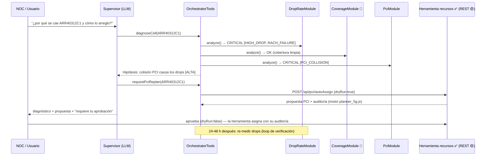

# RAN Advisor — Arquitectura del Triple Agente (Drops · Cobertura · PCI)

> **Documento fuente para la presentación.** Describe la arquitectura y tecnologías del
> "triple agente": un asistente que **lee contadores e identifica drops**, **lee cobertura
> por celda** y **planifica activamente PCI/RSI**. Cada sección está pensada para
> convertirse en una lámina/gráfica. Julio 2026.
>
> **Estado de cada pieza — no todo existe hoy:** este documento mezcla componentes reales,
> una integración propuesta (ficticia por ahora) y un módulo completamente imaginado.
> La matriz de la sección 2 lo deja explícito para no sobrevender.

---

## 1. TL;DR

Un solo punto de entrada (el **supervisor**) orquesta tres dominios de diagnóstico sobre la
misma celda, con capacidades distintas por dominio:

| Dominio | Capacidad | Fuente de datos | ¿Podemos corregir? |
|---|---|---|---|
| **Drops / retenibilidad** | DETECTAR anomalías (contadores) | Contadores 5G NSA (CSV/OSS → PostgreSQL) | No aplica — es el síntoma |
| **Cobertura por celda** | VALIDAR causa (solo lectura) | Geolocalización tipo ariesoGEO (MRs de UEs triangulados) | **No** — la corrección RF es de terceros (Huawei U2020/MAE, tilts/potencia) |
| **PCI / RSI planning** | VALIDAR **y CORREGIR** | Herramienta propia "recursos" (Oracle + planner JS 3G/4G/5G) | **Sí** — auto-asignación con auditoría y aprobación humana |

La lógica que los conecta ya existe y está probada en el branch
`claude/ran-multi-module-orchestration`: SPI `DiagnosticModule` → hallazgos tipados con
**tags** → correlacionador determinista → hipótesis de causa raíz con confianza y acciones.
Este documento extiende ese diseño con el tercer módulo (cobertura) y con la conexión real
a la herramienta de PCI.

---

## 2. Matriz de honestidad — qué es real y qué no (lámina 2)

| Pieza | Estado | Dónde vive |
|---|---|---|
| Agente de drops (LangChain4j, 4 tools, RAG pgvector, guardrails, logging, eval) | ✅ **REAL, funcionando** | repo `DROP-RATE-AG`, branch `master` |
| Orquestador + SPI + correlacionador + módulo PCI demo (datos sembrados) | ✅ **REAL, unit-tested (7/7)** | branch `claude/ran-multi-module-orchestration` |
| Herramienta PCI/RSI "recursos" multi-tecnología (3G/4G/5G) | ✅ **REAL, funcionando** — pero es **otra aplicación** (stack legacy, ver §5) | app "tracker" (Java 8 + Oracle), módulo `com.tracker.web.recursos` |
| Conexión agente ⇄ herramienta PCI ("consultar y asignar el mejor PCI") | 🟡 **PROPUESTA / FICTICIA por ahora** — este doc define el contrato | §5.3 |
| Módulo de cobertura por celda (tipo ariesoGEO) | 🔴 **FICTICIO** — no hay datos ni sistema; se diseña con tablas genéricas para poder presentarlo y mockearlo | §4 |

> Regla para la presentación: todo lo 🔴/🟡 se presenta como **roadmap**, no como demo.

---

## 3. Vista general de arquitectura (lámina 3 — la gráfica principal)

```
                                    ┌──────────────────────────────────────────────┐
                                    │       RAN ADVISOR (Java 17 · Spring Boot 3)   │
 Usuario / NOC ──▶ /agent/ran ──▶   │  RanSupervisorAgent (LLM, LangChain4j)        │
        (Spanish NL)                │   │ enruta, no analiza                        │
                                    │   ▼                                          │
                                    │  OrchestratorTools                            │
                                    │   ├─ diagnoseCell(cell)  ← fan-out SPI        │
                                    │   ├─ routeToDropSpecialist / routeToPci…      │
                                    │   └─ (nuevo) requestPciReplan(cell) ──────────┼────┐
                                    │   ▼                                          │    │
                                    │  CrossModuleCorrelator (reglas deterministas) │    │
                                    │   ▼                                          │    │
                                    │  RootCauseHypothesis {causa, confianza,       │    │
                                    │                       evidencia, acciones}    │    │
                                    └───────┬──────────────┬──────────────┬────────┘    │
                                            │ SPI          │ SPI          │ SPI          │ REST/JSON
                                            ▼              ▼              ▼              ▼
                                   ┌──────────────┐ ┌───────────────┐ ┌──────────────┐  ┌───────────────────────┐
                                   │ DropRate     │ │ Coverage      │ │ Pci          │  │ Herramienta "recursos" │
                                   │ Module       │ │ Module 🔴     │ │ Module       │  │ (app tracker) ✅        │
                                   │ (contadores) │ │ (solo lectura)│ │ (validación) │  │ Java 8 + Nashorn       │
                                   └──────┬───────┘ └──────┬────────┘ └──────┬───────┘  │ planner_3g/4g/5g.js    │
                                          │                │                 │          │ Oracle (tm_conf_*,     │
                                    PostgreSQL       PostgreSQL        PostgreSQL       │  TA semanal/diario)    │
                                    nr_cell_drops    coverage_*        pci_cell/…       │ POST /recursos/…       │
                                    (contadores      (grilla geo       (espejo de       └───────────┬───────────┘
                                     OSS)             tipo ariesoGEO)   solo-lectura)               │
                                                                                          corrección → parámetro
                                                                                          en red vía flujo actual
```

Claves de la gráfica:
- **Los módulos nunca se llaman entre sí**; toda la inteligencia cruzada vive en el
  correlacionador. Los módulos hablan **tags tipados**, no prosa.
- El LLM **enruta y explica**; el veredicto causal es determinista (reproducible,
  auditable, barato, testeable).
- La única flecha de **escritura** hacia la red es la de PCI — y pasa por la herramienta
  real con su auditoría y su gate humano. Cobertura y drops son solo lectura.

---

## 4. Módulo Cobertura por celda — 🔴 ficticio, diseño propuesto (láminas 4-5)

### 4.1 Concepto (basado en cómo funciona ariesoGEO / Viavi)

Las plataformas de geolocalización tipo **ariesoGEO** (hoy Viavi, base de GEOson) toman los
**measurement reports (MRs)** que los UEs ya envían a la red (RSRP/RSRQ/SINR, TA, evento de
conexión) y los **geolocalizan por multilateración/triangulación** (TA + azimut + fingerprint
RF), produciendo miles de millones de eventos ubicados en el mapa **sin drive tests**. Con eso
se construye una **grilla (bins de ~50×50 m)** de cobertura y calidad por celda, de la que salen
diagnósticos como huecos de cobertura, **overshooting** (celda sirviendo mucho más lejos de su
radio de diseño), y **pilot pollution** (demasiadas celdas dominantes en un mismo punto).

> Puente conceptual para la lámina: la herramienta de PCI **ya usa un primo pobre de esto** —
> las distribuciones de **TA** por celda (bins de distancia) para estimar el radio real de cada
> celda. El módulo de cobertura es la versión rica y georreferenciada del mismo insumo.

### 4.2 Tablas genéricas propuestas (PostgreSQL, para mock y luego ingesta real)

```sql
-- Resumen por celda (1 fila por celda y período) — lo que consume el agente
CREATE TABLE coverage_cell_summary (
    id                BIGSERIAL PRIMARY KEY,
    cell_name         VARCHAR(100) NOT NULL,
    period_start      DATE NOT NULL,
    period_end        DATE NOT NULL,
    samples           BIGINT,          -- MRs geolocalizados en el período
    rsrp_p10_dbm      NUMERIC(6,1),    -- percentil 10 de RSRP (borde de celda)
    rsrp_p50_dbm      NUMERIC(6,1),
    sinr_p10_db       NUMERIC(5,1),
    pct_samples_weak  NUMERIC(5,2),    -- % muestras con RSRP < -110 dBm
    design_radius_m   INTEGER,         -- radio de diseño
    effective_radius_m INTEGER,        -- radio real (p95 de distancia de muestras)
    overshoot_ratio   NUMERIC(5,2),    -- effective/design; >1.5 = overshooter
    pct_beyond_design NUMERIC(5,2),    -- % muestras más allá del radio de diseño
    pilot_pollution_pct NUMERIC(5,2),  -- % bins con ≥4 celdas dominantes
    updated_at        BIGINT           -- epoch ms (invariante de sync del proyecto)
);

-- Grilla geolocalizada (N filas por celda) — para mapas y drill-down, no para el agente
CREATE TABLE coverage_grid_bin (
    id           BIGSERIAL PRIMARY KEY,
    cell_name    VARCHAR(100) NOT NULL,
    bin_lat      NUMERIC(9,6) NOT NULL,   -- centro del bin (~50 m)
    bin_lon      NUMERIC(9,6) NOT NULL,
    samples      INTEGER,
    rsrp_avg_dbm NUMERIC(6,1),
    sinr_avg_db  NUMERIC(5,1),
    dominant     BOOLEAN,                  -- ¿esta celda es la dominante del bin?
    distance_m   INTEGER,                  -- distancia al sitio
    updated_at   BIGINT
);
```

### 4.3 El módulo en el SPI (idéntico patrón que drops y PCI)

`CoverageModule implements DiagnosticModule` — **solo lectura**, jamás corrige:

| Elemento | Contenido |
|---|---|
| Tools del agente | `getCellCoverageSummary(cell)`, `getWorstCoverageCells(n)`, `checkOvershooting(cell)` |
| **Tags emitidos** | `WEAK_COVERAGE` (pct_samples_weak > 20 %), `COVERAGE_HOLE` (rsrp_p10 < -115), `OVERSHOOT` (overshoot_ratio > 1.5), `PILOT_POLLUTION` (> 15 %) |
| Severidad | CRITICAL si `COVERAGE_HOLE`/`OVERSHOOT`; WARNING si `WEAK_COVERAGE`/`PILOT_POLLUTION` |
| Acción correctiva | **Ninguna.** El output es una **recomendación/ticket** para el equipo RF (la ejecución — tilt eléctrico, potencia, azimut — vive en herramientas del vendor, p.ej. Huawei U2020/MAE) |

---

## 5. Módulo PCI/RSI — ✅ herramienta real, integración propuesta (láminas 6-7)

### 5.1 Qué es la herramienta hoy (resultado de la revisión del código)

Módulo `recursos` dentro de la app "tracker" (gestión de recursos de celdas nuevas):

| Aspecto | Detalle |
|---|---|
| Stack | **Java 8 (obligatorio: Nashorn)** + Spring MVC/Thymeleaf + Oracle (`ojdbc6`) |
| Motor | `planner_3g.js` / `planner_4g.js` / `planner_5g.js` evaluados vía Nashorn (`javax.script`), engine nuevo por corrida (sin estado compartido) |
| Multi-tecnología | El lote se separa por `Recursos.tecnologia` normalizada (`3G/UMTS/WCDMA`, `4G/LTE`, `5G/NR`); **cada tecnología usa su propia red existente y su propio motor** — sin defaults silenciosos; lo ambiguo se omite con mensaje |
| Red existente 4G | `tm_conf_actual_celda_4g` + TA semanal `PLAN_MAP_SECT_CRIT_4GWEEK` (join por `sector_name`) |
| Red existente 5G | `tm_conf_actual_celda_5g` + TA diario `vw_plani_recursos_5g_ta_diario` (join por `cellname`); PCI 0-1007, tabla RSI 5G embebida en el JS |
| Acotación geográfica | Pre-filtro SQL por **caja de 150 km** alrededor del lote (el motor nunca mira más allá de ~133 km) |
| Uso del TA | Bins de distancia → radio real por celda; con fallback (promedio de 30 vecinas) si no hay tráfico |
| Salidas | PCI (+ RSI), **auditoría por celda** (`AUDITORIA_PCI`, hasta 4000 chars: razones, advertencias, `PCI % 3 == PSS`) |
| Salvaguardas | **No pisa PCI/RSI ya guardados por humanos**; celdas con campos faltantes u omitidas se reportan visiblemente; fallo de un motor no tumba a los otros sub-lotes |
| Superficie actual | `POST /recursos/autoAsignar` — endpoint **MVC (devuelve vista Thymeleaf)**, pensado para click humano, no para API |

### 5.2 Restricción de integración clave (para la lámina de tecnologías)

**Las dos aplicaciones no pueden compartir JVM:** el agente corre Java 17 / Spring Boot 3;
la herramienta exige **exactamente JDK 8** (Nashorn fue eliminado en JDK 15). Además una usa
PostgreSQL y la otra Oracle. Por lo tanto la conexión es **por API REST (o, plan B, por
vista/tabla de intercambio en BD)** — nunca como librería compartida.

### 5.3 Contrato de integración propuesto (🟡 lo "ficticio por ahora")

Del lado de la herramienta, un mini-controlador REST JSON nuevo (mismo servicio interno
`PciRsiAsignacionService`, cero cambio al motor):

| Endpoint (nuevo, en tracker) | Método | Semántica |
|---|---|---|
| `/api/pci/plan/{cellName}` | GET | PCI/RSI actual + auditoría de esa celda (consulta) |
| `/api/pci/validate/{cellName}` | GET | Re-evalúa conflictos de esa celda contra la red existente (dry-run del motor, sin guardar) |
| `/api/pci/autoAssign` | POST `{cells:[], dryRun:true\|false}` | `dryRun=true`: propuesta + auditoría sin persistir. `dryRun=false`: asigna (respetando "no pisar valores humanos") |

Del lado del agente, `PciPlannerClient` (RestClient + API key + timeout + reintentos) y una
tool nueva del orquestador:

- `requestPciReplan(cell)` → llama `dryRun=true`, devuelve la **propuesta con auditoría**;
- la **aplicación real** (`dryRun=false`) queda **detrás de aprobación humana** (el agente
  presenta la propuesta; un humano confirma en la herramienta o vía un segundo paso explícito).

> Mientras el endpoint REST no exista, `PciModule` sigue trabajando sobre el espejo sembrado
> en PostgreSQL (lo ya construido y testeado) — la demo no depende de la integración.

---

## 6. Orquestación del triple agente (láminas 8-9 — el corazón)

### 6.1 El contrato compartido (sin cambios: ya existe y está probado)

`DiagnosticModule.analyze(cell) → ModuleFinding{severity, tags}` + auto-registro Spring
(`List<DiagnosticModule>`): **agregar cobertura no toca al orquestador**, solo se agregan
reglas nuevas al correlacionador.

### 6.2 Matriz DETECTAR / VALIDAR / CORREGIR (lámina resumen)

| Paso | Quién | Ejemplo |
|---|---|---|
| **DETECTAR** | `drop-rate` (contadores): `HIGH_DROP` + causa dominante (`RACH_FAILURE`, `COVERAGE_DEGRADATION`, …) | "ARR40312C1: 30 % drops, causa RA Problem" |
| **VALIDAR** | `pci-planning` (`PCI_COLLISION/CONFUSION/MOD3`) y `coverage` (`OVERSHOOT/WEAK_COVERAGE/COVERAGE_HOLE/PILOT_POLLUTION`) | "esa celda además tiene colisión de PCI 168" / "PCI limpio pero overshoot 2.1×" |
| **CORREGIR** | Solo PCI: `requestPciReplan` → propuesta del motor real → **aprobación humana** → asignación. Cobertura: **ticket/recomendación** al equipo RF (terceros) | "re-plan a PCI 401, auditoría adjunta" |

### 6.3 Reglas de correlación extendidas (las 6 existentes + cobertura)

| # | Señales (tags) | Veredicto | Confianza | Acción |
|---|---|---|---|---|
| 1 | `RACH_FAILURE` + `PCI_COLLISION`/`PCI_CONFUSION` | La PCI es la causa raíz de los drops | **ALTA** | **Corregible**: proponer re-plan (motor real) |
| 2 | `RACH_FAILURE` + `PCI_MOD3` | mod-3/PSS degrada RACH | MEDIA | Re-plan si factible |
| **N1** | `COVERAGE_DEGRADATION` (T310) + `OVERSHOOT` | La celda sirve mucho más allá de su diseño; drops en el borde | **ALTA** | **No corregible por nosotros** → ticket RF (tilt/potencia) con evidencia |
| **N2** | `COVERAGE_DEGRADATION` + `WEAK_COVERAGE`/`COVERAGE_HOLE` | Hueco de cobertura real confirmado por geolocalización | ALTA | Ticket RF; descartar falsa alarma de contadores |
| **N3** | `RACH_FAILURE` + `PILOT_POLLUTION` + PCI limpio | Interferencia por sobre-dominancia, no identidad | MEDIA | Ticket RF; revisar dominancia |
| **N4** | `HIGH_DROP` + PCI limpio + cobertura limpia | Causa fuera de estos dos dominios | BAJA | Seguir causa dominante del módulo de drops |
| 5′ | Conflicto PCI u overshoot **sin** drops todavía | Riesgo latente | MEDIA | PCI: corregir proactivo; cobertura: ticket preventivo |

La regla de oro se mantiene: **dos módulos independientes apuntando a la misma celda por
razones compatibles valen más que cualquiera por separado** — y con tres módulos el
correlacionador además **descarta** hipótesis (N4 evita perseguir fantasmas de RF cuando la
geolocalización dice que la cobertura está bien).

### 6.4 Flujo E2E con acción correctiva (secuencia para la lámina 9)



---

## 7. Stack tecnológico completo (lámina 10 — tabla para la gráfica de tecnologías)

| Capa | Componente | Tecnología | Estado |
|---|---|---|---|
| Conversación | Supervisor + especialistas | Java 17, Spring Boot 3.4, LangChain4j 1.0 (`@Tool`, AiServices), OpenRouter (gpt-4o-mini) | ✅ |
| Orquestación | SPI + fan-out + correlacionador | `DiagnosticModule` / `ModuleFinding` / reglas deterministas (sin LLM) | ✅ |
| Datos agente | Contadores drops, espejo PCI, cobertura | PostgreSQL 16 (+ pgvector para RAG) | ✅ / ✅ / 🔴 |
| Conocimiento | RAG causas de drop | pgvector + embeddings (ada-002 vía OpenRouter) | ✅ |
| Seguridad | Guardrails entrada (2 capas), logging de tools | `InputGuardrail` determinista + `LlmGuardrail`; tabla `agent_logs` | ✅ |
| Calidad | Eval harness (pass-rate) | `com.ranadvisor.eval` | ✅ |
| Planificación PCI | Motor de asignación real | **Java 8 + Nashorn** + `planner_{3g,4g,5g}.js` + Oracle (TA por bins) | ✅ (app aparte) |
| Integración PCI | Cliente REST + endpoints JSON | Spring `RestClient` ⇄ controlador REST nuevo en tracker | 🟡 propuesta |
| Geolocalización | Fuente de cobertura | Plataforma tipo ariesoGEO/Viavi (MRs de UEs, multilateración) → export a `coverage_*` | 🔴 ficticio |
| Corrección RF | Tilts/potencia/azimut | Herramientas del vendor (p.ej. Huawei U2020/MAE) — **fuera de nuestro alcance, solo tickets** | terceros |

---

## 8. Roadmap por fases (lámina 11)

| Fase | Entregable | Depende de |
|---|---|---|
| **A (hoy)** | Demo: drops + PCI espejo + correlacionador (branch orquestación) | nada — ya corre |
| **B** | Endpoints REST JSON en tracker + `PciPlannerClient`; `requestPciReplan` en dry-run | acceso a la app tracker (JDK 8) |
| **C** | `CoverageModule` con datos **mock** en `coverage_*` (tablas §4.2) + reglas N1-N4 | nada externo — mock propio |
| **D** | Ingesta real de geolocalización (export ariesoGEO o equivalente del operador) | licencia/acceso a la plataforma geo |
| **E** | Acción correctiva PCI con aprobación (dryRun:false) + loop de re-medición 24-48 h | B en producción + proceso de cambio |

---

## 9. Riesgos y supuestos (lámina de cierre)

**De la herramienta PCI (heredados de su propia documentación):** join `sector_name` 4G sin
confirmar contra datos reales; posible producto cartesiano si `PLAN_MAP_SECT_CRIT_4GWEEK`
guarda múltiples semanas sin filtro; formato TA (porcentaje vs fracción — autodetectado);
**Nashorn exige JDK 8 en producción** (bloqueante, falla ruidosa al arrancar).

**De la integración (🟡):** exponer REST en una app legacy requiere autenticación/API key y
whitelist de red; `autoAsignar` hoy asigna a celdas *nuevas* (no re-planifica celdas vivas —
el modo `validate`/re-plan de celda existente es funcionalidad nueva del motor a acordar).

**Del módulo de cobertura (🔴):** no hay fuente de datos hoy; los umbrales (§4.3) son
placeholders a calibrar; la precisión de geolocalización (~50-150 m) limita el tamaño de bin.

**Del correlacionador:** las reglas son playbooks de operador, no inferencia causal — la
literatura (ver `ran-anomaly-detection-research.md`) sugiere drift-monitoring sobre los
umbrales y precisión-primero para no generar fatiga de alarmas.

---

## 10. Esqueleto sugerido de la presentación

1. **Problema** — drops sin causa clara; diagnóstico manual lento (hoy: horas por celda).
2. **Matriz de honestidad** (§2) — qué existe, qué es propuesta, qué es visión.
3. **Arquitectura general** (§3, la gráfica ASCII → diagrama bonito).
4. **Detectar** — agente de drops en vivo (demo real, celda ARR40312C1).
5. **Validar I** — PCI: la herramienta real y sus motores 3G/4G/5G (§5.1).
6. **Validar II** — Cobertura tipo ariesoGEO (§4, marcar FICTICIO/roadmap).
7. **Corregir** — solo PCI; flujo con aprobación humana (mermaid §6.4).
8. **El cerebro** — matriz Detectar/Validar/Corregir + reglas de correlación (§6.2-6.3).
9. **Stack** (§7) y **roadmap** (§8).
10. **Riesgos** (§9) y pedido concreto (acceso REST a tracker, fuente geo).

---

## Referencias

- Diseño de orquestación ya implementado: `orchestration-design.md` (mismo directorio).
- Investigación de anomalías RAN: `ran-anomaly-detection-research.md` (branch de research).
- Documentación de la herramienta PCI/RSI: `INTEGRACION_RECURSOS_PCI_RSI.md` (repo tracker)
  + revisión del código fuente (`recursos_3_techs`, julio 2026).
- Concepto ariesoGEO / geolocalización de MRs:
  [VIAVI — GEOson powered by Arieso](https://www.viavisolutions.com/en-us/news-releases/viavi-launches-geoson-powered-arieso-and-reverb-networks) ·
  [patente: geolocalización de measurement reports MDT](https://image-ppubs.uspto.gov/dirsearch-public/print/downloadPdf/12348993)
