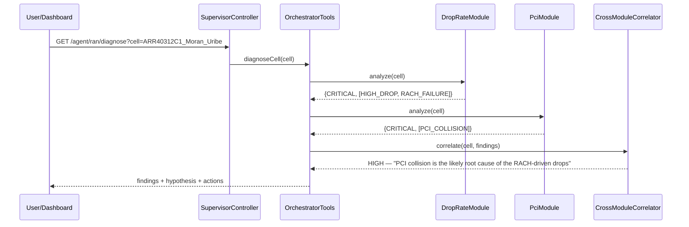

# RAN Advisor — Multi-Module Orchestration Design

> How the platform grows from one drop-rate agent into many diagnostic modules, and —
> the part that matters most — **how those modules are connected and orchestrated** so
> that independent signals combine into a single root-cause answer.
> Worked example: a **PCI-planning module** whose conflicts explain the drop-rate module's
> worst cell. Design + working, unit-tested code. July 2026.

---

## 0. TL;DR

- We add a second diagnostic module — **PCI (Physical Cell Identity) planning** — next to the
  existing drop-rate module. PCI is a canonical RAN problem and, crucially, a *cause* of drops:
  a PCI collision/confusion produces exactly the RACH/handover failures that show up as call drops.
- Every module implements one interface — **`DiagnosticModule.analyze(cell) → ModuleFinding`** —
  emitting machine-readable **tags** (not prose). This is the seam that makes orchestration scale.
- The **orchestrator** connects modules two ways:
  1. **LLM supervisor** (`/agent/ran`) that routes a question to the right specialist, and
  2. a **deterministic correlator** (`/agent/ran/diagnose`) that fans out to *every* module for a
     cell and combines their tags into one ranked **`RootCauseHypothesis`** — no LLM, fully logged.
- Worked, **unit-tested** result for the network's worst cell `ARR40312C1_Moran_Uribe`
  (30.13 % drop rate, dominant cause *RA Problem*):
  > *drop-rate* says **HIGH_DROP + RACH_FAILURE**; *pci-planning* says **PCI_COLLISION** (PCI 168 with
  > neighbour `ARR39931C1_Puente_Quinones`) → correlator verdict: **"PCI collision is the likely root
  > cause of the RACH-driven drops"**, confidence **HIGH**, action: re-plan PCI before RF tuning.
- Adding module #3 (coverage, PRACH RSI, accessibility…) needs **zero orchestrator rewiring** — it is
  auto-discovered via `List<DiagnosticModule>`; you only add correlation rules for its tags.

---

## 1. Mental model: modules are capabilities, the orchestrator composes them

```
                    ┌───────────────────────────────────────────┐
   user ──▶ /agent/ran ──▶  RanSupervisorAgent (LLM front door)  │
                    │        └─ OrchestratorTools (routing + RCA) │
                    └───────────────┬───────────────────────────-┘
                                    │  fan-out (deterministic)
        ┌───────────────────────────┼───────────────────────────┐
        ▼                           ▼                            ▼
  DropRateModule              PciModule                (future) CoverageModule
  analyze(cell)→Finding       analyze(cell)→Finding     analyze(cell)→Finding
        │                           │                            │
   nr_cell_drops               pci_cell / pci_neighbor      rsrp/overshoot…
        └───────────── ModuleFinding{severity, tags} ───────────┘
                                    │
                        CrossModuleCorrelator (rules over tags)
                                    │
                          RootCauseHypothesis
```

Two hard rules keep this from turning into spaghetti:

1. **Modules never call each other.** `PciModule` knows nothing about drops; `DropRateModule` knows
   nothing about PCI. All cross-domain reasoning lives in the orchestrator.
2. **Modules communicate in tags, not prose.** The orchestrator keys off `ModuleFinding.tags`
   (`HIGH_DROP`, `RACH_FAILURE`, `PCI_COLLISION`…), never by parsing an agent's free text.

---

## 2. Why PCI planning is the right second module

We want a module that is (a) realistic and (b) *causally connected* to drops, so orchestration has
something real to correlate.

- **Realistic.** PCI (0..503, = 3·SSS + PSS) is one of the most common RAN optimization tasks. Three
  classic defects: **collision** (two neighbours share a PCI), **confusion** (a cell has two
  neighbours with the same PCI), **mod-3** (neighbours on one carrier share PSS group → sync
  interference).
- **Causally linked to drops.** A PCI collision/confusion makes the UE unable to resolve the correct
  cell during access/handover → **RACH failures and dropped calls**. The drop-rate module's worst
  cell has dominant cause *RA Problem (RACH failure)* — the exact fingerprint of a PCI conflict. That
  is the bridge the orchestrator walks.

Other equally-valid modules (left as future work) would slot in identically: coverage/overshoot,
PRACH root-sequence (RSI) planning, accessibility (RRC setup), sleeping-cell detection.

---

## 3. Mapping a new problem to a module (the recipe)

Every module is the **same seven-part shape** as the drop module, so "creating" one is mechanical.
The parallel:

| Concern | Drop-rate module (existing) | PCI module (new) |
|---|---|---|
| Entity / table | `NrCellDrops` → `nr_cell_drops` | `PciCell` → `pci_cell`, `PciNeighbor` → `pci_neighbor` |
| Repository | `NrCellDropsRepository` | `PciCellRepository`, `PciNeighborRepository` |
| Data seed | `NrCellDropsLoader` (CSV) | `PciDataLoader` (28-cell plan) |
| Tools (`@Tool`) | `DropAnalysisTool` | `PciAnalysisTool` |
| Agent (`@SystemMessage`) | `DropRateAgent` | `PciPlanningAgent` |
| Wiring (`AiServices`) | `DropAgentConfig` | `PciAgentConfig` |
| Standalone endpoint | `DropAgentController` `/agent/drops` | `PciAgentController` `/agent/pci` |
| **SPI adapter (the connector)** | `DropRateModule implements DiagnosticModule` | `PciModule implements DiagnosticModule` |

The first seven rows make the module *usable on its own*. The **last row is what makes it
orchestratable** — see §5.

---

## 4. Creating the PCI module (what was built)

Package `com.ranadvisor.pci`:

- **`PciCell`** (cell → PCI, NR-ARFCN, azimuth) and **`PciNeighbor`** (ANR adjacency). Neighbour set of
  a cell = explicit relations ∪ co-sited cells (same gNodeB).
- **`PciAnalysisTool`** — deterministic detection (no LLM):
  - `detectForCell(cell)` / `detectNetworkWide()` → typed `PciConflict{COLLISION|CONFUSION|MOD3}`.
  - `suggestPci(cell)` → a conflict-free PCI. Two-tier: first try to avoid collision **and**
    confusion **and** mod-3; if the same-carrier neighbourhood already occupies all three PSS groups,
    fall back to a collision/confusion-free PCI (mod-3 is the soft constraint). This mirrors how real
    PCI planning degrades gracefully.
  - Exposed to the agent as four `@Tool`s (`getCellPci`, `checkCellPciConflicts`, `listPciConflicts`,
    `suggestPci`), each logged to `agent_logs` exactly like the drop tools.
- **`PciDataLoader`** seeds a realistic plan for the **same 28 cells** as the drops dataset (so
  cross-module lookups resolve by name), with three **deliberate** conflicts:

| Conflict | Where | Detail |
|---|---|---|
| **COLLISION** | `ARR40312C1_Moran_Uribe` ↔ `ARR39931C1_Puente_Quinones` | both PCI **168** — this is the crafted root cause of the worst cell's drops |
| **CONFUSION** | at `ARR39091C1_Azangaro` | neighbours `ARR39092C1` and `ARR38892C1_Melgar` both PCI **110** |
| **MOD3** | `ARR18911C1_Jm_Cuadros` ↔ `ARR38551C1_Parra` | PCI 10 vs 40, both PSS group 1 |

  (A fourth, *incidental* mod-3 appears at the 4-sector `RESIDENCIAL_LA_LOMADA` site — realistic, and
  it demonstrates the orchestrator's severity ranking: CRITICAL collisions/confusions outrank WARNING
  mod-3.)
- **`PciPlanningAgent` / `PciAgentConfig` / `PciAgentController`** — same LangChain4j pattern as the
  drop agent; standalone at `GET /agent/pci?message=...`.

---

## 5. Connecting the modules (the part that matters)

### 5.1 The naive way, and why we don't do it

The tempting shortcut is to have the orchestrator ask each specialist agent in prose and string-match
the answers ("if the drops reply contains 'RA Problem' and the PCI reply contains 'collision'…").
That couples the orchestrator to wording, breaks under translation (our agents answer in Spanish),
costs two LLM calls, and is untestable. We reject it.

### 5.2 The contract: `DiagnosticModule` + `ModuleFinding` (typed tags)

```java
public interface DiagnosticModule {
    String id();                       // "drop-rate", "pci-planning"
    String domain();
    ModuleFinding analyze(String cell); // deterministic, never throws, never null
}

public record ModuleFinding(String module, String cellName, String severity,
                            String headline, Set<String> tags, String detail) { … }
```

`analyze` is **deterministic and side-effect-free**, so the orchestrator can safely call *every*
module for a cell. The `tags` are the contract surface:

| Module | Tags it emits |
|---|---|
| `drop-rate` | `HIGH_DROP`, `ELEVATED_DROP`, `RACH_FAILURE`, `COVERAGE_DEGRADATION`, `DL_RADIO_QUALITY`, `RECONFIG_FAILURE`, `UL_RADIO_FAILURE`, `TRANSPORT_FAILURE` |
| `pci-planning` | `PCI_COLLISION`, `PCI_CONFUSION`, `PCI_MOD3` |

`DropRateModule` reuses the existing drop formula; `PciModule` wraps `PciAnalysisTool`. Neither
existing file had to change — the SPI is **additive**.

### 5.3 Auto-registration: how it scales to N modules

```java
@Autowired private List<DiagnosticModule> modules;   // Spring injects every @Component module
```

The orchestrator holds a **list of modules**, not references to specific ones. Add a new
`@Component implements DiagnosticModule` and it joins the fan-out automatically — **no orchestrator
edit**. This is the single most important design choice for extensibility.

### 5.4 Three orchestration patterns (and the hybrid we ship)

| Pattern | What | Pro | Con | Used for |
|---|---|---|---|---|
| **Router** | classify → one specialist | cheap, simple | no cross-domain reasoning | single-domain questions |
| **Supervisor / agent-as-tool** | specialist agents exposed as `@Tool`s | natural language in/out | nested LLM calls, cost | `routeToDropSpecialist`, `routeToPciSpecialist` |
| **Shared-tool planner / correlator** | one layer reasons over typed module outputs | deterministic, testable, cheap | needs the tag contract | `diagnoseCell` cross-module RCA |

We ship a **hybrid**: an LLM **supervisor** (`RanSupervisorAgent`) that *routes* self-contained
questions to specialists, but delegates "**why** is cell X bad?" to the **deterministic
cross-module RCA**. The supervisor decides *which* path; the correlator does the *reasoning* that
must be reproducible.

### 5.5 The correlator: the deterministic brain

`CrossModuleCorrelator.correlate(cell, findings)` applies an ordered, auditable rule set over tags
and returns one `RootCauseHypothesis{headline, confidence, rationale, recommendedActions,
contributing}`. The rules (first match wins):

| # | Condition (tags) | Verdict | Confidence |
|---|---|---|---|
| 1 | `RACH_FAILURE` + actionable drop **&** (`PCI_COLLISION` \| `PCI_CONFUSION`) | PCI conflict is the root cause of the drops | **HIGH** |
| 2 | `RACH_FAILURE` + `PCI_MOD3` | mod-3/PSS may be degrading RACH | MEDIUM |
| 3 | `COVERAGE_DEGRADATION` + clean PCI | RF coverage/overshoot (hand to coverage module) | MEDIUM |
| 4 | actionable drop + clean PCI, non-RACH | pursue within drop domain | LOW |
| 5 | PCI conflict + drops OK | fix PCI proactively | MEDIUM |
| 6 | nothing actionable | no cross-module issue | NONE |

Rule 1 is the money rule: two **independent** modules pointing at the same cell for **compatible**
reasons is far stronger evidence than either alone — that is the entire value of orchestration.

### 5.6 Cross-cutting services are shared, not re-implemented

| Concern | Mechanism | Reused by new module? |
|---|---|---|
| Input safety | `InputGuardrail` (deterministic) | yes — extended with PCI/orchestration keywords |
| Semantic safety | `LlmGuardrail` | **no** — it is drop-scoped; a domain-agnostic guardrail is future work |
| Observability | `AgentLog` / `agent_logs` | yes — PCI + orchestrator tools log identically |
| Memory | `MessageWindowChatMemory` | per-agent, same pattern |
| Knowledge (RAG) | pgvector store | available to any module's tools (PCI uses deterministic rules today) |
| Quality | `com.ranadvisor.eval` harness | `/agent/ran/diagnose` is deterministic → trivially eval-able |

---

## 6. End-to-end sequences

**Deterministic cross-module RCA** (`GET /agent/ran/diagnose?cell=…`):



**LLM-orchestrated** (`GET /agent/ran?message=…`): `InputGuardrail` → `RanSupervisorAgent` picks a tool
(`diagnoseCell` for "why", or a specialist for a single-domain question) → answers in Spanish.

**Worked output for the worst cell** (produced by the verified deterministic path):

```
Module findings:
  [drop-rate]    CRITICAL — Drop rate 30.13% (CRITICAL); dominant cause: RA Problem (RACH failure…).
  [pci-planning] CRITICAL — PCI 168 on MBTS_AR4031_MORAN_URIBE: 1 conflict [PCI_COLLISION].
      COLLISION: ARR40312C1_Moran_Uribe and ARR39931C1_Puente_Quinones both use PCI 168 …
      Suggested conflict-free PCI: 0 (PSS group 0).

=== Root-cause hypothesis ===
PCI collision is the likely root cause of the RACH-driven drops on ARR40312C1_Moran_Uribe.  [confidence: HIGH]
Rationale: the drop domain reports RACH-dominated drops and the PCI domain reports a collision on the
same cell; PCI ambiguity manifests exactly as RACH failures and drops.
Recommended actions:
  - Re-plan the PCI to the suggested conflict-free value (see the PCI finding below).
  - After the change, re-measure the drop rate for this cell over the next 24h.
  - Only if drops persist after the PCI fix, escalate to RF coverage/parameter tuning.
```

---

## 7. Endpoints

| Endpoint | Method | Backed by | LLM? |
|---|---|---|---|
| `/agent/drops?message=` | GET | `DropRateAgent` | yes |
| `/agent/pci?message=` | GET | `PciPlanningAgent` | yes |
| `/agent/ran?message=` | GET | `RanSupervisorAgent` (routes + RCA) | yes |
| `/agent/ran/diagnose?cell=` | GET | `OrchestratorTools.diagnoseCell` (fan-out + correlator) | **no** |

---

## 8. Adding the next module (≈ zero orchestrator changes)

To add, say, a **coverage/overshoot** module:

1. Build the seven-part module (`CoverageCell` entity, repo, loader, `CoverageAnalysisTool`,
   `CoverageAgent`, config, `/agent/coverage`). Emit tags like `OVERSHOOT`, `WEAK_COVERAGE`.
2. Add `CoverageModule implements DiagnosticModule`. **It auto-joins** `diagnoseCell`'s fan-out.
3. Add correlation rules for the new tags in `CrossModuleCorrelator` (e.g., `COVERAGE_DEGRADATION` +
   `OVERSHOOT` → "neighbour overshoot is degrading this cell").
4. (Optional) teach the supervisor prompt that a `routeToCoverageSpecialist` tool exists.

Steps 1 touches only the new package; step 2 is one class; step 3 is the *only* change to shared
code, and it is additive.

---

## 9. Design decisions & trade-offs

- **Deterministic correlator over a pure-LLM "meta-agent."** Root-cause verdicts drive network
  changes; they must be reproducible, cheap, testable, and auditable. Rules over typed tags give
  that. The LLM is kept for language/routing, not for the causal call.
- **Typed `ModuleFinding` over string parsing.** Decouples orchestration from wording and language;
  makes `/diagnose` unit-testable without any model.
- **Agent-as-tool kept, but bounded.** The supervisor *can* call specialists (nested LLM), but the
  system prompt caps it at two tool calls and prefers the deterministic path for "why" questions.
- **Guardrail scoping.** `LlmGuardrail` is intentionally drop-specific; reusing it would block PCI
  questions. New front doors use the deterministic guardrail (extended with PCI keywords); a
  domain-agnostic semantic guardrail is future work.
- **Shared `agent_logs`.** One tool-call ledger across all modules and the orchestrator means the
  whole reasoning chain of a cross-module diagnosis is inspectable via `/logs/recent`.

---

## 10. Verification

The deterministic core is covered by `OrchestrationLogicTest`
(`src/test/java/com/ranadvisor/orchestrator/`), **7/7 passing**, no Spring context / DB required:

- worst cell → exactly one COLLISION with `ARR39931C1_Puente_Quinones`, no confusion;
- `ARR39091C1_Azangaro` → CONFUSION on PCI 110;
- network audit → collision + confusion + the 10/40 mod-3;
- `suggestPci(worst)` → collision-free and ≠ 168;
- `PciModule.analyze(worst)` → CRITICAL + `PCI_COLLISION`;
- correlator: RACH drops + PCI collision → **HIGH**, headline names the collision;
- correlator: clean PCI + coverage drops → does **not** blame PCI.

Run: `./mvnw -Dtest=OrchestrationLogicTest test`.
Live end-to-end (needs Postgres + `openai.api-key` in `application.properties`): start the app and call
`GET /agent/ran/diagnose?cell=ARR40312C1_Moran_Uribe`, or ask the supervisor
`GET /agent/ran?message=¿por qué se cae ARR40312C1?`.

---

## 11. Limitations & future work

- **Correlation is heuristic**, not causal inference — it encodes operator playbooks, not a learned
  causal graph. A future version could learn rule weights or use the GNN+Transformer spatio-temporal
  RCA from the anomaly-detection literature.
- **PCI topology is seeded**, not imported from a live OSS/ANR feed.
- **No `updatedAt`/drift handling** on the PCI tables yet; concept-drift monitoring (see the
  anomaly-detection research note) applies to the drop signals that feed rule 1.
- **Semantic guardrail** and per-session memory are shared-service gaps called out above.
